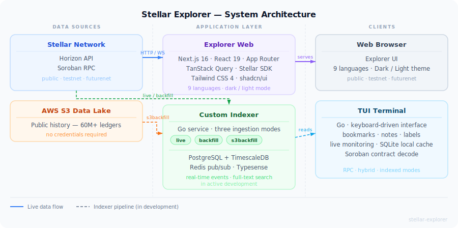

# Stellar View | Stellar Explorer

> A premium block explorer for the Stellar network — built for developers, traders, and ecosystem builders.

[](#) [](#license) [](#) [](#)

---

## Overview

Stellar Explorer gives you a fast, clean window into the Stellar blockchain. Browse ledgers, transactions, accounts, assets, and Soroban smart contracts across **Public**, **Testnet**, and **Futurenet** — all in one place.

The app is **live today**, powered entirely by the Stellar Horizon API and Soroban RPC.

This repository holds the **web app** only. Stellar Explorer also ships a custom indexer and a terminal client, each in their own repository:

| Repo | What it is |
| --- | --- |
| [`StellarViewOrg/indexer`](https://github.com/StellarViewOrg/indexer) | Go service that ingests Stellar network data into PostgreSQL/TimescaleDB, with real-time event publishing via Redis |
| [`StellarViewOrg/tui`](https://github.com/StellarViewOrg/tui) | Terminal client (alpha) plus its dedicated `tui-indexer` backend |
| [`StellarViewOrg/docs`](https://github.com/StellarViewOrg/docs) | Astro/Starlight documentation site |

### Features

| Feature                  | Details                                            |
| ------------------------ | -------------------------------------------------- |
| **Real-time data**       | Live ledger and transaction streaming from Horizon |
| **Multi-network**        | Public mainnet, Testnet, and Futurenet             |
| **Asset discovery**      | Token metadata and logos via `stellar.toml`        |
| **Smart contracts**      | Browse Soroban contract events, code, and storage  |
| **Watchlist**            | Track accounts and assets across sessions          |
| **Dark / Light mode**    | Optimized for both themes                          |
| **9 languages**          | EN, ES, PT, FR, DE, ZH, JA, KO, RU                |

---

## Architecture


> Own elaboration

The Explorer Web app reads live data directly from the **Stellar Horizon API** and **Soroban RPC** — no intermediate backend required. The **Custom Indexer** (see [`StellarViewOrg/indexer`](https://github.com/StellarViewOrg/indexer)) enriches the TUI and future web analytics with historical depth and real-time streaming.

---

## Tech Stack

| Technology | Role |
| --- | --- |
| [Next.js 16](https://nextjs.org/) (App Router) + React 19 | UI framework |
| [TanStack Query](https://tanstack.com/query) | Data fetching and caching |
| [Tailwind CSS 4](https://tailwindcss.com/) + [shadcn/ui](https://ui.shadcn.com/) | Styling and components |
| [Stellar SDK](https://stellar.github.io/js-stellar-sdk/) | Stellar protocol access |
| [Bun](https://bun.sh/) | Package manager and runtime |

---

## Repo Structure

```text
stellar-explorer/
├── apps/
│   └── explorer-web/   # Next.js explorer frontend
├── docs/
│   └── diagrams/       # Architecture SVG diagrams referenced by this README
├── .github/            # CI workflows
├── package.json        # Bun workspace root
└── bun.lock            # Dependency lockfile
```

---

## Getting Started

### Quick start — Explorer Web

```bash
bun install            # Install workspace dependencies
bun run dev:web        # Start frontend at http://localhost:3000
```

That's it. The frontend runs fully against the public Horizon API — no local backend required.

For the indexer, TUI, or docs site, see their dedicated repos linked above — each has its own setup instructions.

---

## Scripts

| Command | Description |
| --- | --- |
| `bun run dev:web` | Start frontend development server |
| `bun run build:web` | Build the frontend |
| `bun run lint:web` | Lint the frontend |
| `bun run test:web` | Run frontend tests |
| `bun run format:web` | Format the frontend |

---

## Deployment

### Vercel (Frontend)

Point the Vercel project to `apps/explorer-web` as the Root Directory. This isolates the production build from the rest of the monorepo.

| Setting | Value |
| --- | --- |
| Framework Preset | `Next.js` |
| Root Directory | `apps/explorer-web` |
| Install Command | _(leave default — Vercel detects the Bun workspace)_ |
| Build Command | `bun run build` |
| Output Directory | _(leave empty)_ |

---

## Contributing

Contributions are welcome. Please read [CONTRIBUTING.md](./CONTRIBUTING.md) before opening a pull request.

---

## License

MIT
