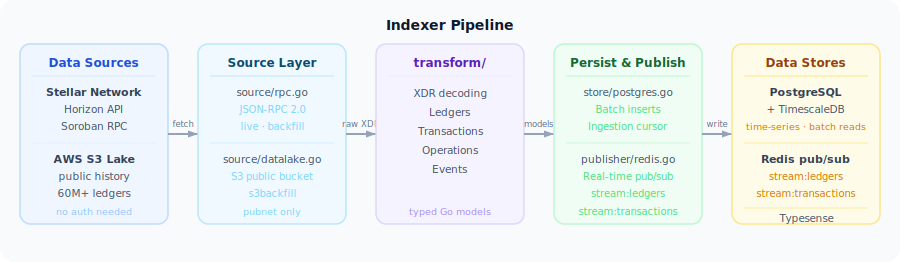

# Stellar View | Stellar Explorer

> A premium block explorer for the Stellar network — built for developers, traders, and ecosystem builders.

[](#) [](#license) [](#) [](#)

---

## Overview

Stellar Explorer gives you a fast, clean window into the Stellar blockchain. Browse ledgers, transactions, accounts, assets, and Soroban smart contracts across **Public**, **Testnet**, and **Futurenet** — all in one place.

The app is **live today**, powered entirely by the Stellar Horizon API and Soroban RPC. We're also building a custom **indexer** that will bring historical depth, richer analytics, and a broader data panorama that the Horizon API alone can't provide.

**TUI** brings Stellar Explorer into the terminal as a functional alpha client, offering a keyboard-driven way to investigate Stellar activity, monitor live data, keep local notes/bookmarks/labels, and move through indexed network context with the dedicated `services/tui-indexer` backend.

### Features

| Feature                  | Details                                            |
| ------------------------ | -------------------------------------------------- |
| **Real-time data**       | Live ledger and transaction streaming from Horizon |
| **Multi-network**        | Public mainnet, Testnet, and Futurenet             |
| **Asset discovery**      | Token metadata and logos via `stellar.toml`        |
| **Smart contracts**      | Browse Soroban contract events, code, and storage  |
| **Watchlist**            | Track accounts and assets across sessions          |
| **Dark / Light mode**    | Optimized for both themes                          |
| **9 languages**          | EN, ES, PT, FR, DE, ZH, JA, KO, RU                |

---

## Architecture


The Explorer Web app reads live data directly from the **Stellar Horizon API** and **Soroban RPC** — no intermediate backend required. The **Custom Indexer** (currently in development) will enrich both the TUI and future web analytics with historical depth and real-time streaming.

---

## The Indexer — Expanding Our Data Horizon

The Horizon API is great for recent data, but it has limits: no deep historical coverage, no custom aggregations, and no way to serve analytics at scale. That's where the indexer comes in.

The **Stellar Explorer Indexer** is a Go service that ingests Stellar network data — ledgers, transactions, and operations — into **PostgreSQL + TimescaleDB**, with real-time event publishing via **Redis**.

### Pipeline



Once fully deployed, the indexer will power:

- **Full historical coverage** — from ledger 3 to present (60M+ ledgers on pubnet)
- **Richer analytics** — charts and aggregations that live APIs can't support
- **Full-text search** — powered by Typesense
- **Real-time event streams** — Redis pub/sub for live updates

### Three Ingestion Modes

---

#### `live` — Real-time Ingestion

Continuously polls the Stellar RPC for new ledgers and ingests them as they close (~1 ledger every 5 seconds). Designed to run indefinitely in production.

```bash
RPC_ENDPOINT=https://soroban-testnet.stellar.org NETWORK=testnet make run-live
```

Shuts down gracefully on `Ctrl+C` and resumes from the last ingested ledger on restart — no duplicates, no gaps.

---

#### `backfill` — Historical Backfill via RPC

Processes a specific range of ledgers in parallel. Works on any network (pubnet, testnet, futurenet). Ideal for catching up after a gap or indexing a targeted range.

```bash
RPC_ENDPOINT=https://soroban-testnet.stellar.org NETWORK=testnet \
  ./bin/indexer backfill --start 1288000 --end 1288100
```

Controlled by `WORKER_COUNT` (default: 8) for parallel throughput.

---

#### `s3backfill` — Mass Historical Backfill from AWS Data Lake

The fastest way to index the entire Stellar pubnet history. Reads directly from the [Stellar public AWS data lake](https://github.com/stellar/stellar-etl) — no RPC endpoint and no AWS credentials required. Covers ledger 3 through the latest pubnet ledger (60M+).

```bash
# Index a million ledgers
./bin/indexer s3backfill --start 3 --end 1000000

# Resume from a checkpoint
./bin/indexer s3backfill --start 500001 --end 1000000

# Crank up workers for maximum throughput
WORKER_COUNT=16 ./bin/indexer s3backfill --start 3 --end 5000000
```

> **Note:** `s3backfill` is pubnet-only. For testnet/futurenet historical data, use `backfill` with an RPC endpoint.

---

## Tech Stack

**Frontend**

| Technology | Role |
| --- | --- |
| [Next.js 16](https://nextjs.org/) (App Router) + React 19 | UI framework |
| [TanStack Query](https://tanstack.com/query) | Data fetching and caching |
| [Tailwind CSS 4](https://tailwindcss.com/) + [shadcn/ui](https://ui.shadcn.com/) | Styling and components |
| [Stellar SDK](https://stellar.github.io/js-stellar-sdk/) | Stellar protocol access |
| [Bun](https://bun.sh/) | Package manager and runtime |

**Indexer**

| Technology | Role |
| --- | --- |
| [Go 1.24](https://go.dev/) | Service runtime |
| [PostgreSQL](https://www.postgresql.org/) + [TimescaleDB](https://www.timescale.com/) | Time-series storage |
| [Redis](https://redis.io/) | Real-time pub/sub |
| [Typesense](https://typesense.org/) | Full-text search |

---

## Monorepo Structure

```text
stellar-explorer/
├── apps/
│   ├── explorer-web/   # Next.js explorer frontend
│   ├── docs/           # Astro/Starlight documentation site
│   └── tui/            # Go terminal client for Stellar investigation
├── services/
│   ├── indexer/        # Stable Go ingestion/indexing service
│   └── tui-indexer/    # Dedicated backend for terminal workflows
├── docs/
│   └── diagrams/       # Architecture SVG diagrams
├── infra/
│   ├── docker/         # Local infrastructure files
│   └── docker-compose.yml
├── .github/            # CI workflows
├── package.json        # Bun workspace root
└── bun.lock            # Shared dependency lockfile
```

---

## Getting Started

### Quick start — Explorer Web

```bash
bun install            # Install workspace dependencies
bun run dev:web        # Start frontend at http://localhost:3000
```

That's it. The frontend runs fully against the public Horizon API — no local backend required.

### TUI — Terminal Client

```bash
bun run tui:build      # Build the Go terminal client
bun run tui:run        # Launch the terminal interface
```

See [`apps/tui/README.md`](./apps/tui/README.md) for configuration, profiles, and hybrid mode setup.

### Indexer

Requires Docker Compose running first:

```bash
# Start PostgreSQL, Redis, and Typesense
docker compose -f infra/docker-compose.yml up -d

# Apply database migrations and build
cd services/indexer && make migrate && make build

# Run live ingestion against testnet
RPC_ENDPOINT=https://soroban-testnet.stellar.org NETWORK=testnet make run-live
```

See [`services/indexer/README.md`](./services/indexer/README.md) for the full configuration reference.

### TUI Indexer (hybrid backend)

```bash
bun run tui-indexer:infra:up    # Start isolated Docker services
bun run tui-indexer:migrate     # Apply migrations
bun run tui-indexer:run:serve   # Start the read API
```

See [`services/tui-indexer/README.md`](./services/tui-indexer/README.md) for the dedicated backend that enriches the TUI with indexed reads, search, timelines, and live-feed data.

### Docs Site

```bash
bun run dev:docs       # Start the documentation site
bun run build:docs     # Production build
```

---

## Scripts

| Command | Description |
| --- | --- |
| `bun run dev:web` | Start frontend development server |
| `bun run build:web` | Build the frontend |
| `bun run tui:build` | Build the Go terminal client |
| `bun run tui:run` | Run the Go terminal client |
| `bun run tui:test` | Run TUI tests |
| `bun run dev:docs` | Start the documentation site |
| `bun run build:docs` | Build the documentation site |
| `bun run indexer:build` | Build the stable Go indexer |
| `bun run indexer:test` | Run stable indexer tests |
| `bun run tui-indexer:build` | Build the dedicated TUI backend |
| `bun run tui-indexer:test` | Run TUI backend tests |
| `bun run tui-indexer:run:live` | Run the TUI backend in live mode |
| `bun run tui-indexer:infra:up` | Start isolated Docker services for `tui-indexer` |

---

## Deployment

### Vercel (Frontend)

Point the Vercel project to `apps/explorer-web` as the Root Directory. This isolates the production build from the rest of the monorepo.

| Setting | Value |
| --- | --- |
| Framework Preset | `Next.js` |
| Root Directory | `apps/explorer-web` |
| Install Command | _(leave default — Vercel detects the Bun workspace)_ |
| Build Command | `bun run build` |
| Output Directory | _(leave empty)_ |

If you deploy the docs on a separate Vercel project, use `apps/docs` as its Root Directory.

---

## Contributing

Contributions are welcome. Please read [CONTRIBUTING.md](./CONTRIBUTING.md) before opening a pull request.

---

## License

MIT
